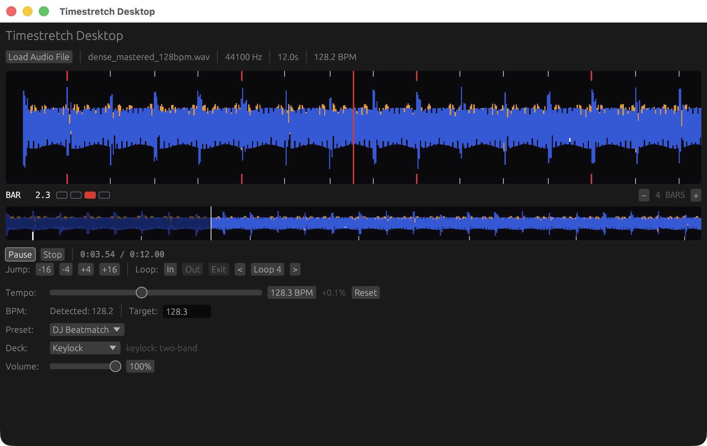

# timestretch

[](https://crates.io/crates/timestretch)
[](https://docs.rs/timestretch)
[](https://github.com/robmorgan/timestretch-rs/actions/workflows/ci.yml)
[](LICENSE)

Pure Rust audio time-stretching library optimized for electronic dance music.

Stretches audio in time without changing its pitch, built around a
real-time-first engine: a varispeed tempo axis with a two-band
time-domain keylock, driven the way a DJ deck drives it. Batch stretching
runs the same engine graph offline. The only external DSP dependency is
[`rustfft`](https://crates.io/crates/rustfft).



*The `desktop/` reference app: a deck running the real-time engine with
beat-grid overlay, beat jumps, looping, and live keylock tempo control.*

## Features

- **Real-time engine** — the audio callback gets exactly the
  frames it needs (`EngineProcessor::process`): infallible, allocation-free,
  lock-free on the audio thread, at a constant per-profile pipeline delay
  (12.7 ms keylock, 48.6 ms wide-range Master Tempo, 0 ms tape)
- **Varispeed-first keylock** — a sinc-resampled tempo axis with a two-band
  keylock chain: the low band's pitch follows tempo (the club-correct
  choice), the high band is corrected by a time-domain SOLA corrector with
  correlation-matched, sub-sample-aligned splices; full single-pitch
  keylock through the entire ±20% DJ fader, graceful varispeed release at
  true extremes (deck-stop / spinback)
- **Deck semantics built in** — lock-free tempo control (immediate or
  timestamped to an exact output frame), warm-start seek/cue with preroll
  priming, gapless loop wraps, and a source-position query aligned to what
  is audible now
- **One engine, both modes** — batch `stretch()` runs the same graph with
  whole-file pre-analysis and exact output length by construction;
  streaming and offline renders are sample-identical at equal rate and
  artifact (a CI gate, not an aspiration)
- **Artifact-first analysis** — analyze a track once (`analyze_for_dj`),
  persist the artifact (BPM, beat grid, transient onsets with strengths),
  and the engine schedules transient protection from it, with online
  fallbacks when no artifact is attached
- **General-purpose beat tracking** — autocorrelation tempogram (50–220 BPM,
  no EDM-range folding) with a dynamic-programming beat tracker, piecewise
  tempo segments, and downbeat estimation
- **Loudness-robust onset detection** — log-compressed spectral flux with a
  robust `median + k·MAD` threshold and an energy-channel gate, so dense
  mastered material yields usable onsets/BPM while sustained tones
  correctly report no beat
- **Externally referenced quality** — CI renders the public CC corpus
  against Rubber Band CLI references and gates on spectral similarity;
  an absolute-threshold quality matrix guards pitch stability, transient
  sharpness, top-octave retention, and click-freeness on every push
- **WCET-bounded callbacks** — per-callback worst-case cost is measured and
  gated in CI (p99.9 ≤ half the callback budget)
- **WAV I/O** — built-in reader/writer for 16-bit, 24-bit, and 32-bit float WAV files
- **Safe Rust** — `#![forbid(unsafe_code)]`, no panics in library code

## Quick Start

Add to your `Cargo.toml`:

```toml
[dependencies]
timestretch = "0.11.0"
```

### One-Shot Stretching

```rust
use timestretch::StretchParams;

// Generate or load audio (f32 samples, -1.0 to 1.0)
let input: Vec<f32> = load_audio();

let params = StretchParams::new(1.5) // 1.5x longer (slower)
    .with_sample_rate(44100)
    .with_channels(1);

let output = timestretch::stretch(&input, &params).unwrap();
```

### DJ Beatmatching (126 BPM to 128 BPM)

```rust
use timestretch::{StretchParams, bpm_ratio};

let original_bpm = 126.0_f64;
let target_bpm = 128.0_f64;
let ratio = bpm_ratio(original_bpm, target_bpm); // source / target = ~0.984

let params = StretchParams::new(ratio)
    .with_sample_rate(44100)
    .with_channels(2); // stereo

let output = timestretch::stretch(&input, &params).unwrap();
```

### Real-Time Engine

```rust
use timestretch::engine::{Engine, EngineConfig, EngineProfile};

let handles = Engine::build(EngineConfig {
    sample_rate: 44_100,
    channels: 2,
    profile: EngineProfile::Keylock, // or Tape: pitch follows tempo
    ..EngineConfig::default()
})
.unwrap();
let (controller, mut processor, mut source) =
    (handles.controller, handles.processor, handles.source);

// Feed thread: push interleaved source audio, watch `demand_hint`.
source.set_track_position(0);
source.push(&interleaved_track[..]);

// UI / control thread (lock-free, wait-free): move tempo any time —
// immediately, or timestamped to land on an exact output frame.
controller.set_tempo_rate(128.0 / 126.0);

// Audio callback: fills exactly the requested frames. Infallible,
// allocation-free, never blocks; underruns deliver counted silence.
let mut out = vec![0.0f32; 256 * 2];
processor.process(&mut out);
```

Each profile has one honest constant latency figure: the keylock chain's
**12.7 ms** pipeline delay, the wide-range Master Tempo chain's
**48.6 ms** (`EngineProfile::WideKeylock` — CDJ-style full-spectrum
keylock across tempo rates 0.25–2.0, a deliberately different contract),
and tape's **0 ms** — with tempo control-to-audio bounded at one
resampler feed chunk in every profile. Warm-start
seek/cue (`controller.warm_start`), gapless loop wraps
(`set_track_position`), and pre-analysis artifacts
(`EngineConfig::pre_analysis`) are first-class deck operations — the
`desktop/` app is the reference integration.

### AudioBuffer API

```rust
use timestretch::{AudioBuffer, StretchParams};

let buffer = AudioBuffer::from_mono(samples, 44100);
let params = StretchParams::new(2.0);
let output = timestretch::stretch_buffer(&buffer, &params).unwrap();

println!("Duration: {:.2}s -> {:.2}s", buffer.duration_secs(), output.duration_secs());
```

### Pitch Shifting

```rust
use timestretch::{EnvelopePreset, StretchParams};

let params = StretchParams::new(1.0)
    .with_sample_rate(44100)
    .with_channels(1)
    .with_envelope_preset(EnvelopePreset::Vocal) // stronger formant retention
    .with_envelope_strength(1.4)
    .with_adaptive_envelope_order(true);

// Shift up one octave (2x frequency), preserving duration
let output = timestretch::pitch_shift(&input, &params, 2.0).unwrap();
assert_eq!(output.len(), input.len());
```

Envelope control quick guide:
- Default profile is `EnvelopePreset::Balanced` (`envelope_strength = 1.0`, adaptive order enabled).
- Use `.with_envelope_preset(EnvelopePreset::Off)` for classic behavior with no formant correction.
- Use `.with_envelope_preset(EnvelopePreset::Vocal)` for stronger vocal formant retention.
- Use `.with_envelope_strength(x)` to scale correction (`0.0..=2.0`), and `.with_adaptive_envelope_order(true)` for content-adaptive cepstral detail.

### BPM-Based Stretching

```rust
use timestretch::StretchParams;

let params = StretchParams::new(1.0) // ratio computed automatically
    .with_sample_rate(44100)
    .with_channels(2);

// Stretch a 126 BPM track to 128 BPM
let output = timestretch::stretch_to_bpm(&input, &params, 126.0, 128.0).unwrap();
```

### Offline Pre-Analysis (Optional)

```rust
use timestretch::{
    analyze_for_dj, read_analysis_file, write_analysis_file, stretch,
    AnalysisFile, BandPeaks, StretchParams,
};
use std::path::Path;

// Build the `.tsa` analysis container once (offline): the beat/onset
// artifact plus the 3-band waveform peaks a player UI needs at load.
let mut analysis = AnalysisFile::for_source(&input, 44100);
analysis.artifact = Some(analyze_for_dj(&input, 44100));
analysis.peaks = Some(BandPeaks::compute(&input, 1, 44100));
write_analysis_file(Path::new("track.wav.tsa"), &analysis).unwrap();

// Load it at runtime and attach the artifact to params
let loaded = read_analysis_file(Path::new("track.wav.tsa")).unwrap();
let params = StretchParams::new(126.0 / 128.0)
    .with_sample_rate(44100)
    .with_pre_analysis(loaded.artifact.unwrap())
    .with_beat_snap_confidence_threshold(0.35)
    .with_beat_snap_tolerance_ms(5.0);

let output = stretch(&input, &params).unwrap();
```

Apps that keep analysis in their own database rather than sidecar files
can use the bytes layer directly — `AnalysisFile::to_bytes` /
`from_bytes` / `from_bytes_validated` — and key blobs by
`AnalysisFile::content_hash`.

### WAV File I/O

```rust
use timestretch::io::wav;

// Read a WAV file
let buffer = wav::read_wav_file("input.wav").unwrap();

// Stretch it (2x = halftime)
let params = timestretch::StretchParams::new(2.0);
let output = timestretch::stretch_buffer(&buffer, &params).unwrap();

// Write the result (16-bit, 24-bit, or float)
wav::write_wav_file_16bit("output_16.wav", &output).unwrap();
wav::write_wav_file_24bit("output_24.wav", &output).unwrap();
wav::write_wav_file_float("output_32.wav", &output).unwrap();

// Or use the one-liner convenience API
timestretch::stretch_wav_file("input.wav", "output.wav", &params).unwrap();
```

## How It Works

The engine is a fixed stage graph driven from the audio callback:

1. **Varispeed head** — the tempo axis is a windowed-sinc resampler:
   tempo retargets are instant and sample-accurate, and the source/output
   timeline mapping is exact (`TimelineMap`).

2. **Two-band split (keylock profile)** — Linkwitz-Riley 8th-order at
   150 Hz. The low band is deliberately NOT pitch-corrected — its pitch
   follows tempo, which is what club sound systems and DJs expect from a
   ±8% nudge — so it needs only a delay matched to the corrector.

3. **Time-domain SOLA correction** — the high band is pitch-corrected by
   an elastic ring reader with correlation-matched, sub-sample-aligned
   splices, steered around transients by the pre-analysis artifact (or an
   online detector when none is attached). Full single-pitch keylock
   through ±20%; beyond that the correction fades to plain varispeed
   (deck-stop/spinback territory).

4. **Exact timeline** — each profile's constant pipeline delay (12.7 ms
   keylock, 48.6 ms wide) is reported, compensated in position queries,
   and structurally trimmed in offline renders; output length is exact by
   construction.

## Parameters

`StretchParams` supports a builder pattern:

```rust
let params = StretchParams::new(1.5)
    .with_sample_rate(48000)
    .with_channels(2)
    .with_normalize(true);
```

Batch `stretch()` runs on the engine graph; ratio, sample rate, channels,
and the optional pre-analysis artifact are the knobs that matter. The
FFT/window/envelope fields on `StretchParams` configure the
phase-vocoder-based `pitch_shift` formant-correction path only.

**Defaults:** 44100 Hz, stereo, keylock crossover at 150 Hz, constant
12.7 ms keylock pipeline delay (0 ms in tape mode).

## Performance

Performance depends on ratio and mode (real-time engine vs offline
batch). The engine's per-callback worst case is measured and gated in CI
(`qa/engine_wcet.rs`).

Run opt-in QA harnesses:

```sh
# These harnesses are excluded from default `cargo test`.

# Throughput-oriented benchmark suite (use release for realistic timing)
cargo test --features qa-harnesses --release --test benchmarks -- --nocapture

# M0 baseline command (strict corpus validation + archive)
./benchmarks/run_m0_baseline.sh

# Quality-gate harnesses (CI-enforced)
cargo test --features qa-harnesses --release --test engine_ab_matrix -- --nocapture
cargo test --features qa-harnesses --release --test engine_keylock -- --nocapture

# Strict callback-budget gate (same mode used in CI)
TIMESTRETCH_STRICT_CALLBACK_BUDGET=1 cargo test --features qa-harnesses --release --test engine_wcet -- --nocapture

# Emit the quality dashboard CSV artifact (ab_matrix.csv)
TIMESTRETCH_QUALITY_DASHBOARD_DIR=target/quality_dashboard cargo test --features qa-harnesses --release --test engine_ab_matrix -- --nocapture

# Reference-quality comparison (strict corpus required)
TIMESTRETCH_STRICT_REFERENCE_BENCHMARK=1 TIMESTRETCH_REFERENCE_MAX_SECONDS=30 cargo test --features qa-harnesses --test reference_quality -- --nocapture

# Ad-hoc reference-quality run (non-strict, short window)
TIMESTRETCH_REFERENCE_MAX_SECONDS=5 cargo test --features qa-harnesses --test reference_quality -- --nocapture

# Single-scenario comparison against an external Rubber Band render
TIMESTRETCH_RUBBERBAND_ORIGINAL_WAV=benchmarks/audio/originals/loop.wav \
TIMESTRETCH_RUBBERBAND_REFERENCE_WAV=benchmarks/audio/references/loop_rubberband.wav \
TIMESTRETCH_RUBBERBAND_RATIO=1.113043478 \
cargo test --features qa-harnesses --test rubberband_comparison -- --nocapture
```

See `benchmarks/README.md` for corpus setup and manifest/checksum requirements.

## API Reference

### Core Types

- **`StretchParams`** — builder-pattern configuration: stretch ratio, sample
  rate, channels, optional pre-analysis artifact, and tempo helpers like
  `from_tempo()`
- **`AudioBuffer`** — holds interleaved sample data with metadata (sample rate,
  channel layout)
- **`EnvelopePreset`** — formant/envelope profile for `pitch_shift`
  (`Off`, `Balanced`, `Vocal`)
- **`engine::Engine` / `EngineConfig` / `EngineProfile`** — the real-time
  engine: `Engine::build` returns `EngineHandles { controller,
  processor, source }` (lock-free control / audio-thread processing / source feed)
- **`PreAnalysisArtifact`** — serializable offline beat/onset analysis artifact
- **`StretchError`** — error type covering invalid parameters, I/O failures,
  and input-too-short conditions

### Functions

**Time stretching:**
- `stretch(&[f32], &StretchParams)` — stretch raw sample data
- `stretch_into(&[f32], &StretchParams, &mut Vec<f32>)` — append stretched output into caller buffer
- `stretch_buffer(&AudioBuffer, &StretchParams)` — stretch an `AudioBuffer`
- `stretch_to_bpm(&[f32], &StretchParams, source_bpm, target_bpm)` — BPM-based stretch
- `stretch_to_bpm_auto(&[f32], &StretchParams, target_bpm)` — auto-detect BPM and stretch
- `stretch_bpm_buffer(&AudioBuffer, &StretchParams, source_bpm, target_bpm)` — BPM stretch for `AudioBuffer`
- `stretch_bpm_buffer_auto(&AudioBuffer, &StretchParams, target_bpm)` — auto BPM stretch for `AudioBuffer`

**Pitch shifting:**
- `pitch_shift(&[f32], &StretchParams, factor)` — shift pitch without changing duration
- `pitch_shift_buffer(&AudioBuffer, &StretchParams, factor)` — pitch shift an `AudioBuffer`

**BPM detection:**
- `detect_bpm(&[f32], sample_rate)` — detect tempo from raw samples
- `detect_bpm_buffer(&AudioBuffer)` — detect tempo from an `AudioBuffer`
- `detect_beat_grid(&[f32], sample_rate)` — detect beat grid positions
- `detect_beat_grid_buffer(&AudioBuffer)` — detect beat grid from an `AudioBuffer`
- `bpm_ratio(source_bpm, target_bpm)` — compute stretch ratio for BPM change

**Pre-analysis pipeline (`.tsa` analysis container):**
- `analyze_for_dj(&[f32], sample_rate)` — generate offline beat/onset artifact
- `AnalysisFile` — one container per track: identity header + artifact + waveform peaks; `to_bytes`/`from_bytes`/`from_bytes_validated` for database-backed storage
- `write_analysis_file(path, &AnalysisFile)` / `read_analysis_file(path)` / `read_analysis_file_validated(path, rate, len, hash)` — sidecar I/O (atomic writes)
- `analysis_file_path(audio_path)` — sidecar convention: `<audio>.tsa`
- `BandPeaks::compute(&[f32], channels, sample_rate)` — 3-band waveform peaks pyramid
- `write_preanalysis_json` / `read_preanalysis_json` — deprecated: legacy JSON sidecars (use the `.tsa` container)

**WAV file convenience:**
- `stretch_wav_file(input, output, &StretchParams)` — read, stretch, and write a WAV file
- `stretch_to_bpm_wav_file(input, output, &StretchParams, source_bpm, target_bpm)` — WAV BPM stretch
- `stretch_to_bpm_auto_wav_file(input, output, &StretchParams, target_bpm)` — WAV auto BPM stretch
- `pitch_shift_wav_file(input, output, &StretchParams, factor)` — read, pitch-shift, and write

See the [API documentation](https://docs.rs/timestretch) for full details.

## Examples

Run the included examples:

```sh
cargo run --example basic_stretch      # Simple time stretch
cargo run --example benchmark_quality  # Offline quality benchmark helper
cargo run --example dj_beatmatch       # 126 → 128 BPM tempo sync
cargo run --example dj_mix             # Streaming DJ transition demo
cargo run --example sample_halftime    # 2x halftime effect
cargo run --example pitch_shift        # Pitch shifting demo
cargo run --example realtime_stream    # Streaming API demo
```

## Audio Format

- Sample format: `f32` (32-bit float, range -1.0 to 1.0)
- Channel layout: mono or stereo (interleaved)
- Sample rates: any standard rate (44100, 48000, etc.)
- WAV I/O: 16-bit PCM, 24-bit PCM, and 32-bit float

## License

MIT
